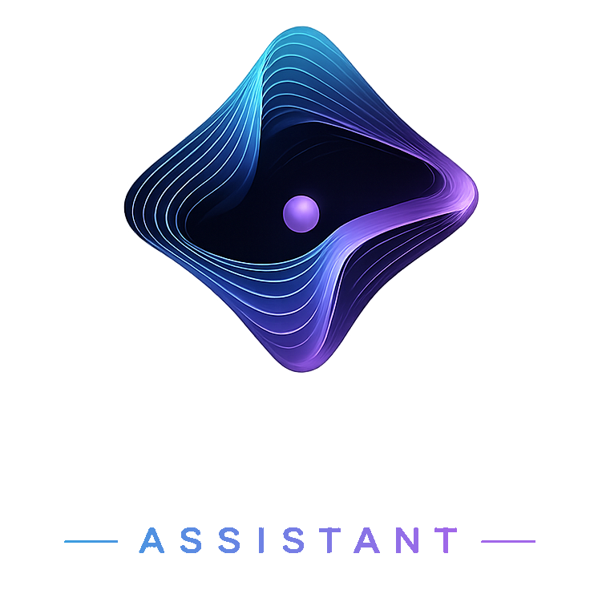
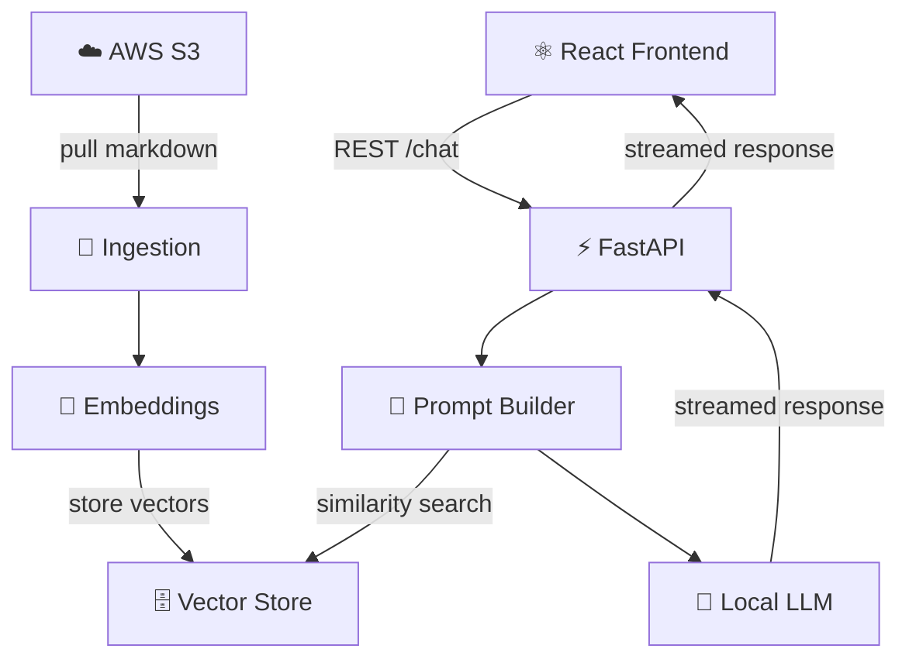

<div align="center">
  
  <p><em>A local-first, AI-powered home assistant that turns your private family knowledge base into a conversational interface - no cloud AI required.</em></p>
  <!-- Badges -->
</div>

## What It Does

Gravity connects to your [Obsidian](https://obsidian.md) vault stored in S3, chunks and embeds your markdown notes, and lets you ask natural-language questions against that knowledge using a fully local LLM. Everything runs on your own hardware; your family's data never leaves your network.

## Architecture



## Tech Stack

| Layer           | Technology                                   |
| --------------- | -------------------------------------------- |
| Frontend        | React                                        |
| Backend API     | FastAPI + Uvicorn                            |
| Embeddings      | `all-MiniLM-L6-v2` via sentence-transformers |
| Vector Store    | PostgreSQL + pgvector                        |
| Local LLM       | Ollama (`llama3:8b-instruct-q4_K_M`)         |
| Document Source | AWS S3 (Obsidian markdown vault)             |

## Getting Started

### Prerequisites

| Requirement                  | Version    | Notes                                 |
| ---------------------------- | ---------- | ------------------------------------- |
| Python                       | 3.11+      | [python.org](https://python.org)      |
| Node.js                      | 18+        | [nodejs.org](https://nodejs.org)      |
| Docker                       | any recent | For PostgreSQL + pgvector             |
| [Ollama](https://ollama.com) | latest     | Local LLM runtime                     |
| AWS credentials              | —          | S3 read access to your Obsidian vault |

### 1 — Pull and serve the local LLM

```bash
ollama pull llama3:8b-instruct-q4_K_M
ollama serve
```

### 2 — Start PostgreSQL + pgvector

```bash
docker-compose up -d
```

### 3 — Install Python dependencies

```bash
python -m venv .venv
source .venv/bin/activate  # Windows: .venv\Scripts\activate

pip install -e .            # runtime deps
pip install -e ".[dev]"     # + dev/test deps
```

### 4 — Configure environment

Shared defaults live in `.env`. Secrets go in `.env.local` (gitignored, loaded last and overrides `.env`).

`.env` (safe to commit, edit as needed):

```env
OLLAMA_MODEL=llama3:8b-instruct-q4_K_M
OLLAMA_BASE_URL=http://localhost:11434
EMBEDDING_MODEL=all-MiniLM-L6-v2
AWS_REGION=us-east-1
POSTGRES_HOST=localhost
POSTGRES_PORT=5432
POSTGRES_DB=gravity
POSTGRES_USER=gravity
```

`.env.local` (secrets — never commit):

```env
POSTGRES_PASSWORD=your-db-password
S3_BUCKET=your-obsidian-vault-bucket
AWS_ACCESS_KEY_ID=...
AWS_SECRET_ACCESS_KEY=...
```

### 5 — Ingest your vault

Pulls markdown from S3, chunks it, generates embeddings, and writes to pgvector:

```bash
gravity-ingest
```

### 6 — Start the backend

```bash
gravity-server
```

API is available at `http://localhost:8000`. Interactive docs at `http://localhost:8000/docs`.

### 7 — Start the frontend

```bash
cd ui && npm install && npm run dev
```

Navigate to `http://localhost:5173`.

---

## Building & Testing

### Run all tests

```bash
pytest
```

### Run a specific suite

```bash
pytest tests/server/     # backend tests
pytest tests/ -v         # verbose output
pytest -k test_name      # filter by test name
```

### Lint

```bash
ruff check .
```

### Build the frontend for production

```bash
cd ui && npm run build
```

## Project Phases

| Phase | Status                | Description                                |
| ----- | --------------------- | ------------------------------------------ |
| 1     | Environment Setup     | Ollama, PostgreSQL, pgvector               |
| 2     | S3 Loader             | Pull markdown files from Obsidian S3 vault |
| 3     | Chunking & Embeddings | Split docs, generate vectors               |
| 4     | Retrieval             | pgvector similarity search                 |
| 5     | LLM Integration       | Ollama prompt construction & response      |
| 6     | FastAPI Backend       | `/chat` endpoint wiring it all together    |
| 7     | React Frontend        | Chat UI with source citations              |

## Planned Enhancements

- Supervisor agent for multi-step reasoning
- Homebridge integration for smart home control
- Hybrid retrieval (BM25 + vector)
- Cross-encoder reranking
- Voice input / output
- Mobile app

## License

[MIT](LICENSE)
